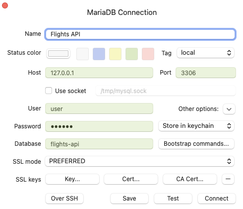

## YouTube Setup

These instructions are for students who are following the YouTube edit of the course.

### Branches

The YouTube edit joins the course partway through. The good news is that exact start point has its own branch named `youtube-start`. Checkout that branch first..
```shell
git checkout youtube-start
```

### Docker

I created Docker images especially for the course so that you'd have everything you need without having to install software yourself..except for Docker of course.

Get up and running with this..
```shell
docker compose up -d
```

Then install all the composer dependencies. In order to ensure you have all the same versions as me, run composer __install__, not update. 
```shell
docker compose exec app composer install
```

### Connect to the database

Credentials for connecting to the DB can be found in the .env file...
```.dotenv
DSN=pdo-mysql://user:secret@db:3306/flights-api?charset=utf8mb4
```

..and also in the docker-compose.yaml file
```yaml
db:
    # ...
    environment:
        MARIADB_ROOT_PASSWORD: secret
        MARIADB_DATABASE: flights-api
        MARIADB_USER: user
        MARIADB_PASSWORD: secret
    ports:
        - "3306:3306"
```

You can use those credentials to connect your DB admin tool of choice. I use [TablePlus](https://tableplus.com/) in the video.



You now have all the configuration you need to follow along.

GLHF